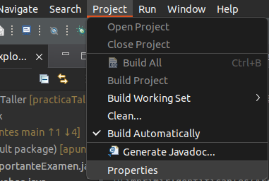
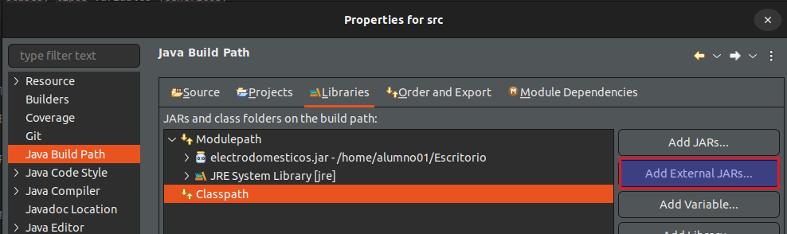

# Apuntes clase POO

## Importar librería externa .jar



## Comparable
Lo implementamos en la clase que queramos comparar (en este caso DESCENDENTE)
```
public class Comentario implements Comparable<Comentario> {

...

@Override
	public int compareTo(Comentario comentario) {
			
		return -this.getFecha().compareTo(comentario.getFecha());

	}
  

```

Otro ejemplo (útil para comparar primitivos como double)
```
  
@Override
	public int compareTo(CopaHelado copaHelado) {
		
		int resultado = 0;
		
		if (this.getPrecioTotal() < copaHelado.getPrecioTotal()) {
			
			resultado = 1;
		} if (this.getPrecioTotal() > copaHelado.getPrecioTotal()) {
			
			resultado = -1;
			
		} 
		
		
		return resultado;
	}
```

## Comparator

En otra clase
```

public class ComparadorCopaHelado implements Comparator<CopaHelado>{
	
	@Override
	public int compare(CopaHelado copaHelado1, CopaHelado copaHelado2) {
		
		// COMPARAMOS POR NUMERO DE COMPLEMENTOS (PRIMERO LOS QUE MAS COMPLEMENTOS TENGAN)
		int comparador = -Integer.compare(copaHelado1.getNumComplementos(), copaHelado2.getNumComplementos());
		
		// SI CON IGUALES, POR PRECIO (ORDEN NATURAL)
		if (comparador == 0) {
			
			comparador = copaHelado1.compareTo(copaHelado2);
			
		}
		
		return comparador;
	}

	
	
}
    
```

Otro ejemplo
```
public class ComparadorComentario implements Comparator<Comentario>{
	
	
	
	
  @Override
  public int compare(Comentario comentario1, Comentario comentario2) {

    // Por numero de estrellas de mayor a menor
    int comparador = -Integer.compare(Likes.getLikesFor(comentario1).length, Likes.getLikesFor(comentario2).length);

    // SI SON IGUALES, DE MAS ANTIGUA A MAS RECIENTE
    if (comparador == 0) {

      comparador = -comentario1.compareTo(comentario2);

    }

    return comparador;
	}
}

```


En la AppMain
```

Comparator<Comentario> comparadorLikes = new Comparator<Comentario>() {

  @Override
  public int compare(Comentario c1, Comentario c2) {
    int resultado = -Integer.compare(Likes.getLikesFor(c1).length, Likes.getLikesFor(c2).length);
    if (resultado == 0) {
      resultado = c1.getInstant().compareTo(c2.getInstant());
    }
    return resultado;
  }
  };
    
```

La llamamos creando un objeto en la AppMain
```

ComparadorCopaHelado comparadorCopaHelado = new ComparadorCopaHelado();
listaComparadorCopaHelados.sort(comparadorCopaHelado);
    
```


## Metodo Spread
Admite array, uno, o varios elementos separados por comas
```

public boolean setComentarios(Comentario comentario) {
		
  if (comentarios == null) {

    this.comentarios = new ArrayList<Comentario>();

  }

  comentarios.add(comentario);
  return true;

}
	
	
// SPREAD METHOD - Para que admita array, uno, o varios separados por comas
protected void setComentarios(Comentario ...newComentarios) {
		
  if (comentarios == null) {
			
    this.comentarios = new ArrayList<Comentario>();
    this.comentarios = Arrays.asList(newComentarios);

  } else {

    for (Comentario comentario : newComentarios) {

      setComentarios(comentario);

    }			
  }	
}
    
```

Otro ejemplo de SPREAD, que devuelve una lista
```
public static List<String> devuelveString(String... string) {
		
		List<String> listaStrings = new ArrayList<>();
		
		listaStrings.addAll(Arrays.asList(string));
		
		System.out.println(listaStrings.toString());
		return listaStrings;
	}
```

## Formato precios
METODO AUXILIAR PARA HACER PRINT EN FORMATO DE LOS PRECIOS
``` 
public static String printPrecio(double precio) {
		
  // LIMITAMOS EL NUMERO DE DECIMALES A 2
  DecimalFormat df = new DecimalFormat("0.00");

  return df.format(precio);

}
```

## GENÉRICO
Método genérico con una Collection
```
private static <T extends IIngrediente & IDescriptible & IPrecio> void imprimirCuenta(Collection<? extends T> productos) {
		
  double sumaTotal = 0;

  System.out.println("--- Resumen de cuenta ---");

  for (T t : productos) {
    System.out.println(t.getDescripcion() + ": " + printPrecio(t.getPrecio()) + "€");
    sumaTotal += t.getPrecio();
  }

  System.out.println("Total " + productos.size() + " productos: " + printPrecio(sumaTotal) + "€");


}
```

## LISTA ESTÁTICA 'constante y modificable'
Tres formas de crear una lista estática, a la que se le pueden añadir elementos

OPCION 1
```
private final static List<Complemento> LISTA_COMPLEMENTOS2 = new ArrayList<>(
	List.of(new Complemento("Virutas de chocolate", 0.5), 
		new Complemento("Galletitas", 0.8))
		);
```


OPCION 2. Es la mejor opcion si luego vamos a querer añadir una lista externa
```
private final static List<Ingrediente> LISTA_COMPLEMENTOS;	

static {

	LISTA_COMPLEMENTOS = new ArrayList<>();
	LISTA_COMPLEMENTOS.add(new Complemento("Virutas de chocolate", 0.5));
	LISTA_COMPLEMENTOS.add(new Complemento("Galletitas", 0.8));

	// AÑADIMOS LOS COMPLEMENTOS DE LA CLASE EXTERNA
	for (Extra complementoExtra : Extra.EXTRAS) {

		LISTA_COMPLEMENTOS.add(new Complemento(complementoExtra.getDescription(), complementoExtra.getPrice()));

	}
}
```	

OPCION 3
```	
private final static List<Complemento> LISTA_COMPLEMENTOS3 = new ArrayList<>(
		Arrays.asList(new Complemento("Virutas de chocolate", 0.5), 
				new Complemento("Galletitas", 0.8))
		);
```

EN MAIN. Si va en la clase del main (fuera del método main), tendremos que instanciar 
```
private final static Collection<Producto> PRODUCTOS = new ArrayList<>();

public static void main(String[] args) {
	(...)
	PRODUCTOS.add(producto1);
	PRODUCTOS.add(producto2);
	(...)
}
```

## Generar número entero aleatorio
Genera número aleatorio entre 1 y 100, AMBOS INCLUÍDOS
```
Random numRandom = new Random();
int numeroAleatorio= numRandom.nextInt(1, 101);
```
